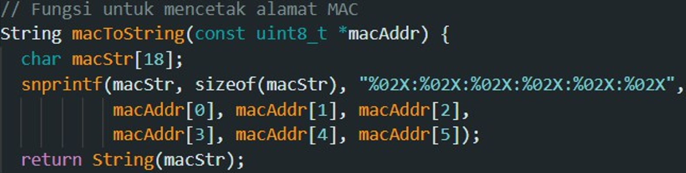

# Jaringan-Mesh-Menggunakan-Autentikasi-antar-Node-dengan-ESP-Now

## Deskripsi Proyek
Proyek ini merupakan implementasi jaringan mesh sederhana menggunakan ESP32 dengan protokol komunikasi ESP-NOW, dilengkapi dengan mekanisme autentikasi antar-node menggunakan kombinasi alamat MAC dan PIN. Selain itu, sistem juga terintegrasi dengan MQTT broker agar data dari setiap node dapat diteruskan ke dashboard IoT.

## Hardware
- 3 Perangkat ESP32
- 3 Kabel micro USB

## Software
- Arduino IDE
- MyMQTT

## Fitur Utama
- 📡 Komunikasi mesh antar beberapa node ESP32 menggunakan ESP-NOW.
- 🔒 Autentikasi ganda (alamat MAC + PIN) untuk memastikan hanya node sah yang bisa ikut berkomunikasi.
- 🌐 Integrasi dengan MQTT, sehingga data dari mesh network bisa dipantau melalui dashboard IoT.
- 🛠️ Konfigurasi fleksibel, tiap ESP32 menggunakan kode yang sama namun dibedakan berdasarkan alamat MAC dan isi pesan.
- ⚡ Sistem berjalan real-time dan semua node harus dijalankan bersamaan.

## Skematik Rangkaian

## Flowchart 

## Hasil Uji Konfigurasi sistem
Setiap node diuji dengan cara menjalankan semua esp32 dan melihat di bagian serial Monitor untuk memastikan pesan terkirim dan diterima dengan baik, berikut adalah gambar dari serial monitornya :

### Output Serial Monitor ESP1

Output pada serial monitor dimana esp1 telah berhasil mengirim dan menerima pesan dari esp 2 dan esp 3.

### Output Serial Monitor ESP2

Output pada serial monitor dimana esp2 telah berhasil mengirim dan menerima pesan dari esp 1 dan esp 3.

### Output Serial Monitor ESP3

Output pada serial monitor dimana esp3 telah berhasil mengirim dan menerima pesan dari esp 1 dan esp 2.

### Proses Autentikasi antar-node
1. Autentikasi menggunakan Alamat mac.

    
    Kode yang berfungsi untuk membuat alamat mac untuk penerima.

    
    Kode yang berfungsi untuk mencetak alamat mac.

    
    Kode yang berfungsi untuk verifikasi alamat mac pengirim.

    
    Pada gambar diatas menunjukan contoh serial monitor jika ada node dengan Alamat mac yang tidak sah (tidak dikenal) mengirim pesan pada komunikasi ini, maka pesan dari node tersebut akan di blokir.

2. Autentikasi menggunakan pin
   
      
    Kode untuk membuat pin autentikasi.
   
      
    Kode untuk memverifikasi pin.
   
      
    Pada gambar diatas menunjukan output pada serial monitor jika ada node lain yang hendak masuk kedalam komunikasi ini menggunakan pin yang salah, maka otomatis pesan dari node tersebut akan ditolak.
   
      
    Pada gambar diatas menunjukan validasi alamat mac dan pin telah berhasil dan telah bisa berkomunikasi antar node dalam jaringan mesh.

3. Konfigurasi MQTT
   
    
    Kode yang berisi konfigurasi untuk terhubung ke mqtt.  
   
    
    Kode untuk mengirim data dari tiap node ke mqtt.  
   
      
    Pada gambar diatas kita bisa melihat bahwa komunikasi antar node telah berjalan dengan baik, semua node bisa menerima pesan dari 2 node lainnya dan meneruskan pesan yang diterimanya beserta pesannya sendiri ke MQTT.

## Catatan!!
- Setiap esp32/node menggunakan sketch/kode yang sama secara fungsi hanya saja berbeda konfigurasi alamat mac dan isi pesan.
- Proyek ini mengharuskan semua esp32/node dijalankan secara bersamaan.

## Referensi
[Getting Started with ESP-NOW (ESP32 with Arduino IDE)](https://randomnerdtutorials.com/esp-now-esp32-arduino-ide/)
